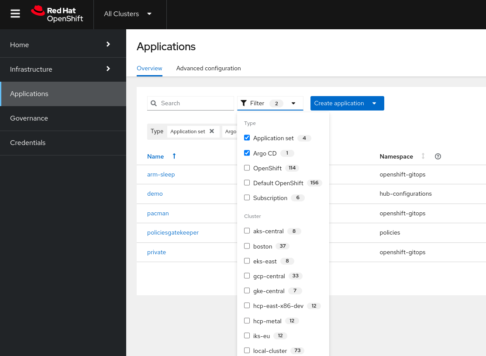
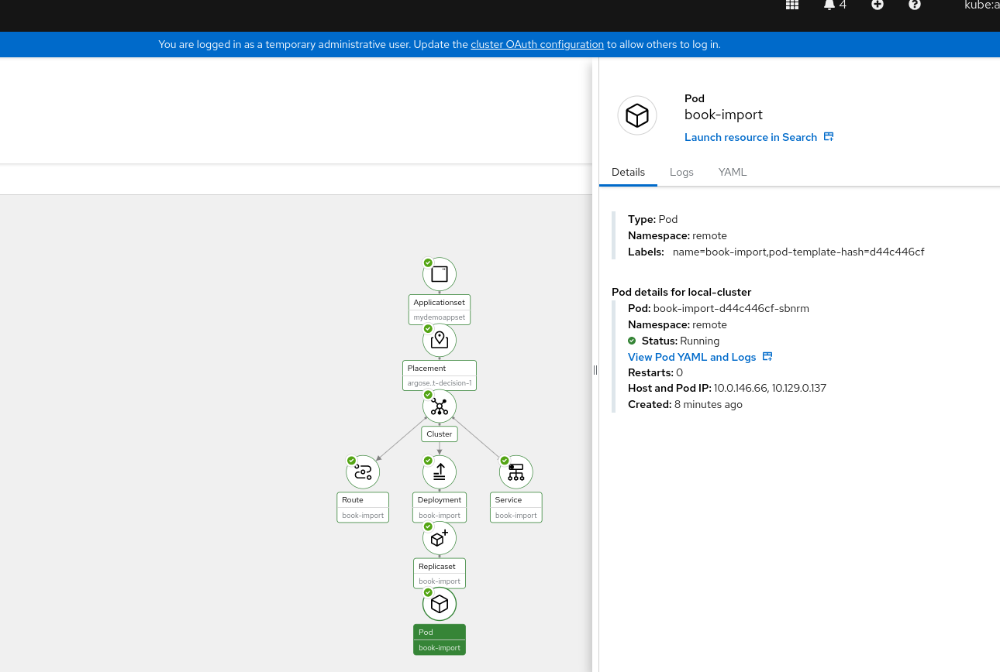
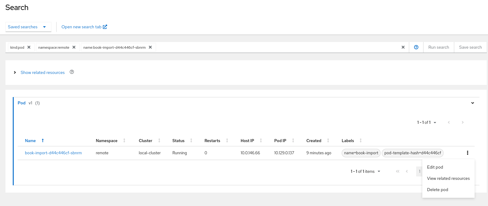
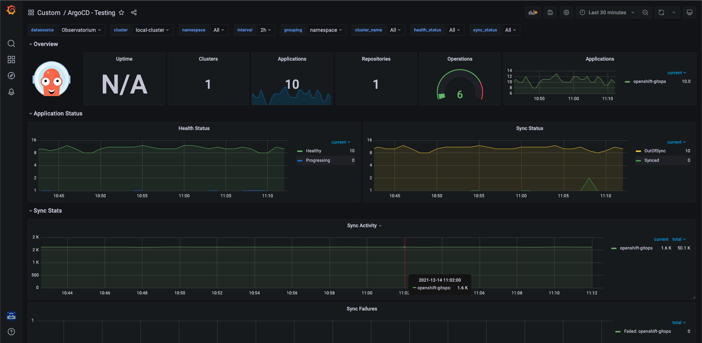
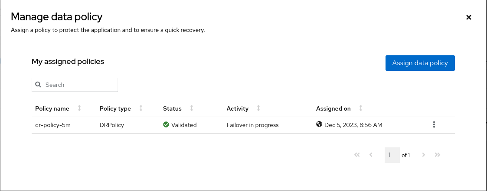
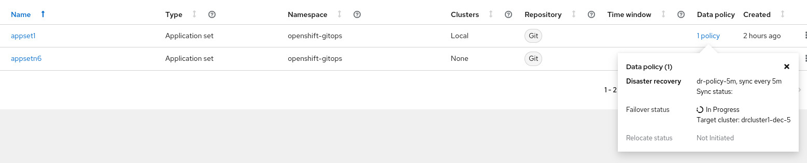

# 10 Reasons to Choose Red Hat Advanced Cluster Management (RHACM) for GitOps with ArgoCD

Utilizing Red Hat Advanced Cluster Management (RHACM) for GitOps in conjunction with ArgoCD brings about a synergistic integration. In particular, we'd like to emphasize the advantages of combining these tools, specifically GitopsOperator (Red Hat's downstream version of ArgoCD). By doing so, you unlock enhanced benefits compared to running GitopsOperator as a standalone solution. This collaborative approach not only optimizes functionality but also streamlines the overall GitOps experience, showcasing the added value of this integrated setup.


## 1. UI-Support for ApplicationSets, and getting all relevant info from a "Single Pane of Glass"

While ArgoCD's user interface isn't explicitly designed for MultiCluster-Management, RHACM fills the gap by offering a user-friendly interface equipped with the capability to handle ApplicationSets. This feature enables you to efficiently define and manage multiple applications across clusters. The Single Pane of Glass view takes the complexity out of monitoring and managing applications, providing a consolidated and streamlined overview of your entire multi-cluster environment. In essence, RHACM enhances the user experience by simplifying the intricacies of multi-cluster application management.




## 2. Integration with MultiCluster Search

Effectively discover and manage resources across multiple clusters with the integrated MultiCluster Search feature in RHACM. This capability empowers administrators to promptly identify and take action on resources, thereby enhancing the overall observability and control of the Kubernetes landscape.






## 3. Pull-Model Option

**RHACM Pull-Model Option: Enhancing Flexibility and Control**

RHACM supports a pull-model option, enabling you to synchronize configurations from Git repositories using ArgoCD without requiring the Hub to connect to the spokes. This flexibility allows you to choose the workflow that best fits your organizational needs, be it a pull or push model. Enjoy various benefits offered by the Pull-Model option, such as enhanced performance, managing GitOps installations with policies, and detailed AppSet summary reports.

*Advantages of the Pull Model: Decentralized Control*

The pull model decentralizes control, where each cluster possesses its copy of the configuration and is responsible for independently pulling updates. The hub-managed architecture, incorporating Argo CD and the pull model, reduces the need for a centralized system to manage configurations across target clusters, enhancing scalability and simplifying overall system management. Note that while the hub cluster minimizes single points of failure, it's essential to address this potential concern through redundancy or other means.

*Flexibility and Reduced Risks*

The pull model provides increased flexibility, allowing clusters to pull updates according to their schedule, thereby minimizing the risk of conflicts or disruptions.

For more detailed information, you can refer to our [blog post](https://cloud.redhat.com/blog/introducing-the-argo-cd-application-pull-controller-for-red-hat-advanced-cluster-management).


## 4. Integration with Cluster Lifecycle

Simplify cluster lifecycle management with RHACM's integrated tools. Binding managed clusters to the GitOps namespace via custom resources like Placement and ManagedClusterSetBinding creates a crucial token-containing secret for synchronization with GitOps. Admin access to the GitOps namespace grants privileges over the managed cluster.

To register clusters for deployment through OpenShift GitOps, use the GitOpsCluster custom resource. This allows deploying applications to any managed cluster within RHACM. Refer to the example below:

```
apiVersion: apps.open-cluster-management.io/v1beta1
kind: GitOpsCluster
metadata:
  name: gitops-cluster-sample
  namespace: dev
spec:
  argoServer:
    cluster: local-cluster
    argoNamespace: openshift-gitops
  placementRef:
    kind: Placement
    apiVersion: cluster.open-cluster-management.io/v1beta1
    name: all-openshift-clusters 
```

## 5. Strong Built-in RBAC Support with Centralized Push Model

Previously, in the ArgoCD push model within ACM, end-users utilized a cluster admin SA to deploy applications. Now, with the introduction of a new feature, end-users can deploy applications using a customized service account with specific permissions.

The Managed Service Account, an OCM addon, facilitates seamless management of service accounts across multiple clusters for hub cluster admins. The addon agent monitors and rotates the token by controlling the creation and removal of the service account, ensuring security back to the hub cluster. Granting permissions to the new service account is achieved through the utilization of the new cluster permission resource.

```
apiVersion: operator.open-cluster-management.io/v1
kind: MultiClusterHub
metadata:
  name: multiclusterhub
  namespace: open-cluster-management
spec:
  availabilityConfig: High
  enableClusterBackup: false
  imagePullSecret: multiclusterhub-operator-pull-secret
  ingress: {}
  overrides:
    components:
      - enabled: true
        name: app-lifecycle
      - enabled: true
        name: cluster-lifecycle
      - enabled: true
        name: cluster-permission
```

learn [here](https://github.com/ch-stark/enable-managed-service-account) how to set this up via Policies. 

```
apiVersion: rbac.open-cluster-management.io/v1alpha1
kind: ClusterPermission
metadata:
  name: clusterpermission-msa-subject-sample
  namespace: cluster1
spec:
  roles:
  - namespace: mortgage
    rules:
    - apiGroups: ["apps"]
      resources: ["deployments"]
      verbs: ["get", "list", "create", "update", "delete", "patch"]
    - apiGroups: [""]
      resources: ["configmaps", "secrets", "pods", "services", "namespace"]
      verbs: ["get", "update", "list", "create", "delete", "patch"]
    roleBindings:
  - namespace: mortgage
    roleRef:
      kind: Role
    subject:
      apiGroup: authentication.open-cluster-management.io
      kind: ManagedServiceAccount
      name: managed-sa-sample
  clusterRoleBinding:
    subject:
      apiGroup: authentication.open-cluster-management.io
      kind: ManagedServiceAccount
      name: managed-sa-sample
```

## 6. Integration with Placement for Advanced MultiCluster Scheduling

Take advantage of advanced scheduling capabilities with RHACM's integration with Placement. Efficiently distribute workloads across clusters based on defined policies, optimizing resource utilization and improving overall cluster performance.

Discover the extensive capabilities of Placement [here](https://open-cluster-management.io/concepts/placement/) .  

Notable features include:

- **Scoring-Based Prioritization:** Efficiently prioritize resources using a scoring mechanism.
- **Extensibility:** Customize and extend Placement to suit specific requirements.
- **Rollout Strategy:** Implement strategic rollout plans for optimal resource deployment.
- **Spread:** Ensure even distribution of resources across your environment.

See here an example of a Placement which is configured to tolerate temporary cluster-unavailablity:

```
apiVersion: cluster.open-cluster-management.io/v1beta1
kind: Placement
metadata:
  name: placement
  namespace: ns1
spec:
  tolerations:
    - key: cluster.open-cluster-management.io/unreachable
      operator: Exists
    - key: cluster.open-cluster-management.io/unavailable
      operator: Exists
```

## 7. MultiCluster Optimized Dashboards

Effortlessly visualize and analyze the health and performance of your multi-cluster environment with RHACM's optimized dashboards. Take command of your data visualization experience by creating your own dashboards in a managed and controlled way using a Grafana-Developer instance which you can later bring into production.

These purpose-built dashboards provide valuable insights into the status of applications, clusters, and resources, enabling informed decision-making. Let's now proceed to create a customized dashboard tailored for visualizing ArgoCD using some well documented [ArgoCD-metrics](https://argo-cd.readthedocs.io/en/stable/operator-manual/metrics/):

```
cat >observability-metrics-custom-allowlist.yaml<<
kind: ConfigMap
apiVersion: v1
metadata:
  name: observability-metrics-custom-allowlist
data:
  metrics_list.yaml: |
    names:
      - argocd_cluster_info
      - argocd-server-metrics
      - argocd_app_info
      - argocd_app_sync_total
      - argocd_app_reconcile_count
      - argocd_app_reconcile_bucket
      - argocd_app_k8s_request_total
      - argocd_kubectl_exec_pending
      - argocd-metrics
      - argocd_cluster_api_resource_objects
      - argocd_cluster_api_resources
      - argocd_git_request_total
      - argocd_git_request_duration_seconds_bucket
      - argocd-repo-server
      - argocd_redis_request_total
      - argocd_appset_applied_total
      - argocd_appset_applied_failed_total
      - argocd_appset_applied_duration_seconds_bucket.
      - argocd_appset_reconcile_total
      - argocd_appset_reconcile_failed_total
      - argocd_appset_reconcile_duration_seconds_bucket
```


See here an example how a dashboard might look like: 



## 8 Gatekeeper Integration
 
Effectively manage Kubernetes ApplicationSets with ACM/OpenShiftPlus using Gatekeeper Constraints and ConstraintTemplates. Gatekeeper enforces policies, ensuring adherence to rules, with ConstraintTemplates defining policy structures. Applied to ApplicationSets, Gatekeeper Constraints enforce policies for consistency in creation, configuration, and behavior, fostering standardized and compliant applications. ConstraintTemplates act as blueprints, enabling administrators to customize policies, establishing a controlled, secure, and streamlined environment for Kubernetes deployments.

See here a Gatekeeper-Example:

```
apiVersion: templates.gatekeeper.sh/v1
kind: ConstraintTemplate
metadata:
  name: k8snoappindefaultargoproject
  annotations:
    description: >-
      Restricts any ArgoCD Applications to be created in default ArgoCD project
spec:
  crd:
    spec:
      names:
        kind: K8sNoAppInDefaultArgoProject
  targets:
    - target: admission.k8s.gatekeeper.sh
      rego: |
        package k8snoappindefaultargoproject
        violation[{"msg": def_msg}] {
          name := input.review.object.metadata.name
          mySpec := input.review.object.spec
          mySpec.project == "default"
          def_msg := sprintf("Error: `%v` ArgoCD Application is not permitted to use default ArgoCD project.",[name])
        }
```

Learn [here](https://github.com/ch-stark/gatekeeper-examples) how to use Gatekeeper with RHACM

## 9. Integration with Governance for Advanced Use Cases (object-raw-templates)

Leverage RHACM's integration with Governance to implement advanced use cases, such as managing custom objects and raw templates. This flexibility empowers you to tailor your Kubernetes configurations to meet specific requirements.

```
object-templates-raw: |
  {{ range $placedec := (lookup "cluster.open-cluster-management.io/v1beta1" "PlacementDecision" "openshift-gitops" "" "cluster.open-cluster-management.io/placement=aws-app-placement").items }}
  {{ range $clustdec := $placedec.status.decisions }}
  - complianceType: musthave
    objectDefinition:
      apiVersion: authentication.open-cluster-management.io/v1alpha1
      kind: ManagedServiceAccount
      metadata:
        name: managed-sa-sample
        namespace: {{ $clustdec.clusterName }}
      spec:
        rotation: {}
  - complianceType: musthave
    objectDefinition:
      apiVersion: rbac.open-cluster-management.io/v1alpha1
      kind: ClusterPermission
      metadata:
        name: clusterpermission-msa-subject-sample
        namespace: {{ $clustdec.clusterName }}
  {{ end }}
  {{ end }}
```

The below example just allows manual sync for app-projects:

```
object-templates-raw: >
  {{- range $appproj := (lookup "argoproj.io/v1alpha1" "AppProject" "openshift-gitops" "").items }}
  - complianceType: musthave
    objectDefinition:
      apiVersion: argoproj.io/v1alpha1
      kind: AppProject
      metadata:
        name: '{{ $appproj.metadata.name }}'
        namespace: openshift-gitops
      spec:
        syncWindows:
          - kind: deny
            schedule: '* * * * *'
            duration: 24h 
            manualSync: true
            clusters:   
              - '*'
            applications:
              - '*'
            namespaces:
              - '*'
  {{- end }}
```

## 10. Advanced Disaster Recovery Capabilities with ODF Integration

Integrate RHACM with Open Data Foundation (ODF) for advanced Disaster Recovery (DR) capabilities. Ensure the resilience of your applications and data across clusters, minimizing downtime and providing a reliable solution for business continuity.

See here how to configure failover for Application-Sets in the UI using ODF:





## Summary ##

Red Hat Advanced Cluster Management for Kubernetes (RHACM) stands out as a powerful solution for GitOps with ArgoCD. Whether you are looking for centralized control with a push model or decentralized flexibility with a pull model, RHACM has you covered. From UI-Support and MultiCluster Search to strong RBAC support and advanced disaster recovery capabilities with ODF integration, RHACM provides a feature-rich experience.
