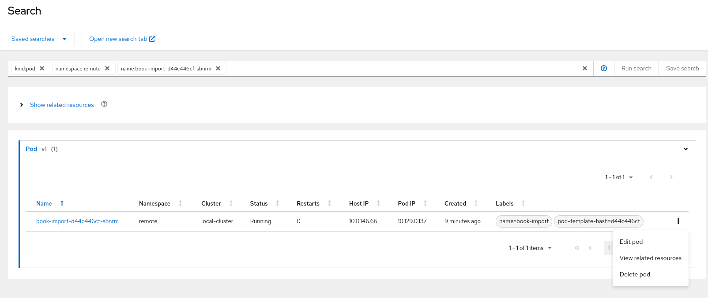

# 10 Reasons to Choose Red Hat Advanced Cluster Management (RHACM) for GitOps with ArgoCD

## 1. UI-Support for ApplicationSets, and getting all relevant info from a "Single Pane of Glass"

While ArgoCD's UI is not designed for MultiCluster-Management, RHACM offers a user-friendly interface with support for ApplicationSets, allowing you to define and manage multiple applications across clusters. The Single Pane of Glass view provides a consolidated overview of your entire multi-cluster environment, simplifying the monitoring and management of applications.

## 2. Integration with MultiCluster Search

Efficiently locate and manage resources across multiple clusters with RHACM's integrated MultiCluster Search. This feature empowers administrators to quickly identify and act upon resources, enhancing the overall observability and control of the Kubernetes landscape.




## 3. Pull-Model Option

RHACM supports a pull-model option, allowing you to synchronize configurations from Git repositories using ArgoCD. This flexibility enables you to choose the workflow that best fits your organizational needs, whether it's a pull or push model. Enjoy the benefits of the Pull-Model option, such as enhanced performance, managing GitOps installations with policies, and comprehensive AppSet summary reports. 

The advantage of the pull model is decentralized control, where each cluster has its own copy of the configuration and is responsible for pulling updates independently. The hub-managed architecture using Argo CD and the pull model can reduce the need for a centralized system to manage the configurations of all target clusters, making the system more scalable and easier to manage. However, note that the hub cluster itself still represents a potential single point of failure, which you should address through redundancy or other means.

Additionally, the pull model provides more flexibility, allowing clusters to pull updates on their schedule and reducing the risk of conflicts or disruptions.

For more details see also https://cloud.redhat.com/blog/introducing-the-argo-cd-application-pull-controller-for-red-hat-advanced-cluster-management


## 4. Integration with Cluster Lifecycle

Streamline the cluster lifecycle management with RHACM's integrated tools. When you integrate with the GitOps operator for every managed cluster that is bound to the GitOps namespace through the placement and ManagedClusterSetBinding custom resources, a secret with a token to access the ManagedCluster is created in the namespace. This is required for the GitOps controller to sync resources to the managed cluster. When a user is given administrator access to a GitOps namespace to perform application lifecycle operations, the user also gains access to this secret and admin level to the managed cluster.

Create a GitOpsCluster custom resource to register the set of managed clusters from the placement decision to the specified instance of OpenShift GitOps. This enables the OpenShift GitOps instance to deploy applications to any of those Red Hat Advanced Cluster Management managed clusters. Use the multicloud-integrations GitOps cluster example.

Note: The referenced Placement resource must be in the same namespace as the GitOpsCluster resource. See the following example:

apiVersion: apps.open-cluster-management.io/v1beta1
kind: GitOpsCluster
metadata:
  name: gitops-cluster-sample
  namespace: dev
spec:
  argoServer:
    cluster: local-cluster
    argoNamespace: openshift-gitops
  placementRef:
    kind: Placement
    apiVersion: cluster.open-cluster-management.io/v1beta1
    name: all-openshift-clusters 1

## 5. Strong Built-in RBAC Support with Centralized Push Model

Before the new feature, end-users use a cluster admin SA to deploy applications when using ArgoCD push model in ACM. With the new feature, end-users can deploy applications using a customized service account with specific permissions.

The Managed Service Account is an OCM addon enabling a hub cluster admin to manage service accounts across multiple clusters with ease. By controlling the creation and removal of the service account, the addon agent will monitor and rotate the corresponding token back to the hub cluster. To grant permissions to the new service account, we leverage the new cluster permission resource.

```
apiVersion: operator.open-cluster-management.io/v1
kind: MultiClusterHub
metadata:
  name: multiclusterhub
  namespace: open-cluster-management
spec:
  availabilityConfig: High
  enableClusterBackup: false
  imagePullSecret: multiclusterhub-operator-pull-secret
  ingress: {}
  overrides:
    components:
      - enabled: true
        name: app-lifecycle
      - enabled: true
        name: cluster-lifecycle
      - enabled: true
        name: cluster-permission
```

learn [here](https://github.com/ch-stark/enable-managed-service-account) how to set this up via Policies. 


```yaml
apiVersion: rbac.open-cluster-management.io/v1alpha1
kind: ClusterPermission
metadata:
  name: clusterpermission-msa-subject-sample
  namespace: cluster1
spec:
  roles:
  - namespace: mortgage
    rules:
    - apiGroups: ["apps"]
      resources: ["deployments"]
      verbs: ["get", "list", "create", "update", "delete", "patch"]
    - apiGroups: [""]
      resources: ["configmaps", "secrets", "pods", "services", "namespace"]
      verbs: ["get", "update", "list", "create", "delete", "patch"]
    roleBindings:
  - namespace: mortgage
    roleRef:
      kind: Role
    subject:
      apiGroup: authentication.open-cluster-management.io
      kind: ManagedServiceAccount
      name: managed-sa-sample
  clusterRoleBinding:
    subject:
      apiGroup: authentication.open-cluster-management.io
      kind: ManagedServiceAccount
      name: managed-sa-sample

## 6. Integration with Placement for Advanced MultiCluster Scheduling

Take advantage of advanced scheduling capabilities with RHACM's integration with Placement. Efficiently distribute workloads across clusters based on defined policies, optimizing resource utilization and improving overall cluster performance.

See here an example of a Placement which is configured to tolerate temporary cluster-unavailablity:

```yaml
apiVersion: cluster.open-cluster-management.io/v1beta1
kind: Placement
metadata:
  name: placement
  namespace: ns1
spec:
  tolerations:
    - key: cluster.open-cluster-management.io/unreachable
      operator: Exists
    - key: cluster.open-cluster-management.io/unavailable
      operator: Exists

## 7. MultiCluster Optimized Dashboards

Visualize and analyze the health and performance of your multi-cluster environment through RHACM's optimized dashboards. Gain insights into the status of applications, clusters, and resources, facilitating informed decision-making.

In the following we create a Dashboard to display ArgoCD:

cat >observability-metrics-custom-allowlist.yaml<<YAML
kind: ConfigMap
apiVersion: v1
metadata:
  name: observability-metrics-custom-allowlist
data:
  metrics_list.yaml: |
    names:
      - argocd_cluster_info
      - argocd-server-metrics
      - argocd_app_info
      - argocd_app_sync_total
      - argocd_app_reconcile_count
      - argocd_app_reconcile_bucket
      - argocd_app_k8s_request_total
      - argocd_kubectl_exec_pending
      - argocd-metrics
      - argocd_cluster_api_resource_objects
      - argocd_cluster_api_resources
      - argocd_git_request_total
      - argocd_git_request_duration_seconds_bucket
      - argocd-repo-server
      - argocd_redis_request_total
      - argocd_appset_applied_total
      - argocd_appset_applied_failed_total
      - argocd_appset_applied_duration_seconds_bucket.
      - argocd_appset_reconcile_total
      - argocd_appset_reconcile_failed_total
      - argocd_appset_reconcile_duration_seconds_bucket
YAML

## 8 Gatekeeper Integration
 

ApplicationSets in Kubernetes can be effectively managed and controlled through Gatekeeper Constraints and ConstraintTemplates which are supported with ACM/OpenShiftPlus. Gatekeeper is a policy controller that enforces policies in a Kubernetes cluster, ensuring that resources adhere to specific rules. ConstraintTemplates define the structure and parameters of policies, while Constraints are instances of these templates applied to specific resources.

When applied to ApplicationSets, Gatekeeper Constraints can enforce policies related to their creation, configuration, and behavior. For instance, constraints can dictate that all ApplicationSets must include certain labels, use specific image versions, or comply with security standards. This ensures consistency and compliance across diverse applications within the cluster.

ConstraintTemplates serve as blueprints, allowing administrators to define and customize policies according to their specific requirements. By employing Gatekeeper Constraints and ConstraintTemplates, organizations can maintain a standardized and secure environment, streamline deployment processes, and enhance overall cluster governance for ApplicationSets in Kubernetes. This approach contributes to efficient resource utilization and facilitates a more controlled and resilient Kubernetes ecosystem.

See here a Gatekeeper-Example:

```yaml
apiVersion: templates.gatekeeper.sh/v1
kind: ConstraintTemplate
metadata:
  name: k8snoappindefaultargoproject
  annotations:
    description: >-
      Restricts any ArgoCD Applications to be created in default ArgoCD project
spec:
  crd:
    spec:
      names:
        kind: K8sNoAppInDefaultArgoProject
  targets:
    - target: admission.k8s.gatekeeper.sh
      rego: |
        package k8snoappindefaultargoproject
        violation[{"msg": def_msg}] {
          name := input.review.object.metadata.name
          mySpec := input.review.object.spec
          mySpec.project == "default"
          def_msg := sprintf("Error: `%v` ArgoCD Application is not permitted to use default ArgoCD project.",[name])
        }

## 9. Integration with Governance for Advanced Use Cases (object-raw-templates)

Leverage RHACM's integration with Governance to implement advanced use cases, such as managing custom objects and raw templates. This flexibility empowers you to tailor your Kubernetes configurations to meet specific requirements.

```yaml
object-templates-raw: |
  {{ range $placedec := (lookup "cluster.open-cluster-management.io/v1beta1" "PlacementDecision" "openshift-gitops" "" "cluster.open-cluster-management.io/placement=aws-app-placement").items }}
  {{ range $clustdec := $placedec.status.decisions }}
  - complianceType: musthave
    objectDefinition:
      apiVersion: authentication.open-cluster-management.io/v1alpha1
      kind: ManagedServiceAccount
      metadata:
        name: managed-sa-sample
        namespace: {{ $clustdec.clusterName }}
      spec:
        rotation: {}
  - complianceType: musthave
    objectDefinition:
      apiVersion: rbac.open-cluster-management.io/v1alpha1
      kind: ClusterPermission
      metadata:
        name: clusterpermission-msa-subject-sample
        namespace: {{ $clustdec.clusterName }}
  {{ end }}
  {{ end }}


## 10. Advanced Disaster Recovery Capabilities with ODF Integration

Integrate RHACM with Open Data Foundation (ODF) for advanced Disaster Recovery (DR) capabilities. Ensure the resilience of your applications and data across clusters, minimizing downtime and providing a reliable solution for business continuity.

## Summary ##

Red Hat Advanced Cluster Management for Kubernetes (RHACM) stands out as a powerful solution for GitOps with ArgoCD. Whether you are looking for centralized control with a push model or decentralized flexibility with a pull model, RHACM has you covered. From UI-Support and MultiCluster Search to strong RBAC support and advanced disaster recovery capabilities with ODF integration, RHACM provides a feature-rich experience.


